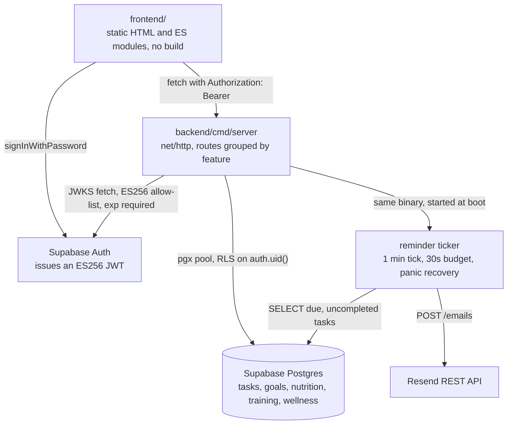

# MustDo

A dark-themed personal tracker that grew from a todo list into a small health-and-productivity dashboard: tasks, goals, nutrition, training, and daily wellness logs, all under one login.

## What it does

Five trackers behind one Supabase login, on purpose sharing a single Go binary and a single Postgres database rather than being five apps.

Tasks are one-off or recurring, daily or on specific weekdays, with per-day completion and optional email reminders.
Goals are bucketed by timeframe: week, month, year, lifetime.
Nutrition has reusable foods and meals, a daily log, and calorie and macro targets to compare against.
Training tracks exercises, logged sets, and workout templates for progressive overload.
Wellness is a daily body-weight, sleep, and mood log.
The dashboard puts streaks and trend sparklines across all of it.

The build is deliberately boring: one Go binary with stdlib `net/http` and no framework or ORM, plain HTML, CSS, and JS with no build step at all, and Supabase for Postgres and auth.
The one part that isn't boring is the reminder ticker, and it's the reason the deploy config looks the way it does. Reminders run as a goroutine in the same process as the HTTP server, checking due tasks every minute, so `fly.toml` sets `min_machines_running = 1` and `auto_stop_machines = false`.
A stateless API would scale to zero happily. This one has to stay awake.

## Tech stack

| Layer | What it uses |
| --- | --- |
| Backend | Go 1.26, stdlib `net/http`, no framework |
| Database | Supabase Postgres via `pgx/v5`, RLS policies keyed on `auth.uid()` |
| Auth | Supabase Auth, ES256 JWTs verified with `golang-jwt/jwt/v5` plus `MicahParks/keyfunc` for JWKS |
| Frontend | Plain HTML, CSS, and ES modules. No bundler, no npm install, Supabase JS from a CDN |
| Email | Resend's REST API called directly, no SDK |
| Deploy | Fly.io on distroless for the backend, Vercel for the static frontend, nginx in Compose |

Five direct Go requires.

## Architecture



The frontend is static files, so it holds no secrets and does no work beyond fetch calls: it signs in against Supabase Auth directly, gets an ES256 JWT, and sends it as a bearer token to the Go backend.
The backend verifies that token against Supabase's JWKS with an explicit algorithm allow-list and a required expiry, then talks to Postgres through a `pgx` pool where row-level security scopes every query to the caller.
The ticker is the only thing that isn't request-driven: it wakes once a minute, looks for tasks that are due, have a reminder set, and are not already complete, and calls Resend.
Each tick is bounded by a 30 second timeout and recovers from its own panics, because it shares a process with the HTTP server and taking that down over a stalled email would be a poor trade.

## What building this taught me

Reading back through the history, almost every fix in this repo is the same bug wearing a different hat: something failed and said nothing.

**A rejected request with no error handler looks exactly like a frozen UI.** `apiFetch` threw correctly on any non-2xx or network failure, and nothing caught it. So a dropped connection or an expired session meant saving, deleting, or completing a task did nothing at all, with the modal just sitting there. The checkbox case was worse, because the box stayed visually ticked for a completion that never persisted. It now surfaces the error and reverts the checkbox to match reality.

**`await` in a refresh function is an accidental dependency.** `refreshView()` awaited `loadTasks()` first and only reached `refreshHero()` if that succeeded. I found this on the live site while it couldn't reach its backend over an unrelated CORS problem: the hero's date text, which needs no network call whatsoever, wasn't rendering either. Four independent refreshes now run under `Promise.allSettled`, so one failing fetch can't take the others with it, and an error still surfaces if any of them failed.

**Supabase's `signUp()` can succeed without giving you a session.** With email confirmation required, it returns successfully and no session, and my code redirected to `index.html` regardless, where `requireSession()` immediately bounced the user back to the login page with no explanation. It looked exactly like a failed signup. It says "check your email" now, and both buttons disable during the request so you can't double-submit.

**A reminder that fires for a completed task is worse than no reminder.** `DueReminders` never checked completion status, so a task you finished before its reminder window closed still got emailed as if pending, for both recurring and non-recurring tasks. That code path had zero test coverage at the time, which is the more useful thing to notice: the background job was the least tested and most autonomous part of the system.

**A negative number can make a time window mathematically unreachable.** `reminder_minutes_before` accepted negatives, which put the reminder window in the future relative to the due time, so the reminder simply never fired and nothing anywhere reported a problem. It's rejected at the boundary now, with a test that says so.

**Raw driver errors in a 500 body leak your schema.** Unexpected failures were returning the driver's error text straight to the client, which can include table and column names. Those are logged server-side and answered generically now. Validation errors still return their specific message, because a 400 is meant to be read by whoever caused it.

**Stubbing the parts of Supabase that CI lacks beats keeping a CI-only migration.** The plain Postgres service container has no `auth.users` table and no `auth.uid()` function, so the real migration files failed to apply and the integration tests couldn't run. Rather than maintaining a second copy of the schema for CI, the workflow stubs just enough of `auth`, a users table for the foreign key and a no-op `uid()` so the RLS policies create. CI now runs the exact migration file that production runs.

**Grouping by a display string merges data that isn't the same.** Category grouping keyed on the label, so tasks genuinely named "Other" fell into the same bucket as tasks with no category at all, and legacy lowercase categories became an uncoloured unordered pile because matching was case-sensitive in the grouping but not in the edit form. Null and "Other" are distinct keys now, and matching is case-insensitive in both places.

## Quick start

Requires Go 1.26+, Docker, and the Supabase CLI.

```bash
supabase start                 # local Postgres and Auth
cp .env.example .env           # fill in the values supabase start prints
cd backend && go run ./cmd/server
```

Serve `frontend/` with any static file server, `npx serve frontend` works, and open it.

Or use Compose for the two pieces that otherwise need manual commands. The database and auth stack is still `supabase start`, since it manages its own containers:

```bash
supabase start
docker compose up --build
```

That comes up on `http://localhost:8090`, with `js/config.docker.js` mounted over `js/config.js` so the production config file stays untouched, and the backend reaching the Supabase stack through `host.docker.internal`.

Tests run against a real Postgres container, not mocks, which is also what CI does on every push:

```bash
cd backend && go vet ./... && go test ./...
```

Without `RESEND_API_KEY` set, the reminder ticker logs what it would have sent rather than sending, so local development needs no Resend account.

### Deploying

The frontend goes to Vercel with **Root Directory** set to `frontend/` and an empty build command. Because there's no build step to inject environment variables, `frontend/js/config.js` has to carry the real Supabase URL, anon key, and backend URL before you push, and the Vercel domain has to be added to the backend's `FRONTEND_ORIGINS` for CORS.

The backend goes to Fly, built from `backend/Dockerfile` as a static binary on distroless:

```bash
cd backend
fly launch --no-deploy
fly secrets set DATABASE_URL=... SUPABASE_URL=... FRONTEND_ORIGINS=https://your-app.vercel.app \
  RESEND_API_KEY=... REMINDER_FROM_EMAIL=... REMINDER_TO_EMAIL=... TZ=America/Los_Angeles
fly deploy
```

Migrations live in `supabase/migrations/` and go up with `supabase link --project-ref <ref>` then `supabase db push`.
